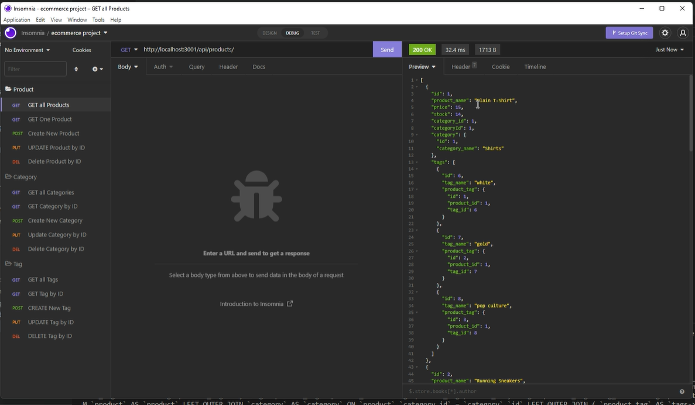

# eCommerce Back-End Project

## Overview
This challenge assignment was to build the back end of an ecommerce site utilizing starter code, Express.js, Sequelize, and an original MySQL database. 

## Description
Acceptance Criteria is as follows:

GIVEN a functional Express.js API
WHEN I add my database name, MySQL username, and MySQL password to an environment variable file
THEN I am able to connect to a database using Sequelize

WHEN I enter schema and seed commands
THEN a development database is created and is seeded with test data

WHEN I enter the command to invoke the application
THEN my server is started and the Sequelize models are synced to the MySQL database

WHEN I open API GET routes in Insomnia for categories, products, or tags
THEN the data for each of these routes is displayed in a formatted JSON

WHEN I test API POST, PUT, and DELETE routes in Insomnia
THEN I am able to successfully create, update, and delete data in my database

## Table of Contents

1. [Installation](#installation)
2. [Usage](#usage)
3. [Licenses](#licenses)
4. [Contributing](#contributing)
5. [Tests](#tests)
6. [Questions](#questions)

## Installation
A link to the deployed site can be found [here](https://ks-ecomerce-backend.herokuapp.com/). The walkthrough for this application can be found [here](https://drive.google.com/file/d/1xhj17ojwejzJnMPEnRtFd2ktXR5lqQN1/view). A screenshot of the site is shown below: 

## Usage
To use this application, a user will need to install all packages and access MySQL. In MySQL, the user will need to SOURCE the schema file and also run npm run seed to seed the database once it is created. 

## Licenses
This project uses the MIT license. More info about licenses can be found [here](https://choosealicense.com/).

## Contributing
This project is open for contribution but please initiate an issue for any significant changes. 

## Tests
There are no testing instructions for this project at this time.

## Questions
The developer can be reached through [email](mikeandkris27@gmail.com) or contacted through [Github](https://github.com/kristensantee) or [LinkedIn](https://linkedin.com/in/kristen-santee).
